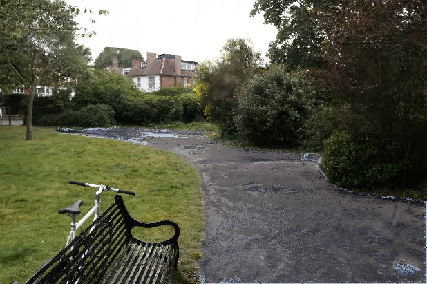

# 3DGS-RTMaterial V3

> Semester project for **SFU CMPT 743** (Visual Computing).

Current release: **v3.2-multiview-selection**. Run the application with
`python rt_gs_gui_v3.py`; the other GUI layers are internal package modules.

This project provides a GUI for segmenting **3D Gaussian Splatting** scenes,
assigning materials, and rendering the edited result. It supports SAGA features,
OptiX ray tracing, spherical-harmonic (SH) editing, and a manually controlled
**PBR-lite** renderer. PBR-lite is a forward-rendering mode; it does not estimate
materials or lighting from the training images.

---

## Demo

| RGB Baseline | Segmentation |
|:---:|:---:|
|  |  |

**Material Assignment & Ray Tracing**

| | |
|:---:|:---:|
|  |  |

**Demo Video**

[▶ Watch demo video](demo/Screencast%20from%202026-04-07%2022-43-38.webm)

### Research preview: physically separated road water film



This is a **new work-in-progress material implementation**. It preserves the
fitted M2 road albedo and adds a separately controlled physical water-film
response. The material model and visual quality are still being adjusted.

---

## Features

- **Dual material pipeline**
  - *Stylized (SH Edit)* — the V2.2 SH-edit workflow
  - *PBR-lite* — manual albedo, roughness, metallic, opacity, and IOR
  - *Original* and *Compare Stylized/PBR* inspection modes

- **PBR-lite renderer**
  - Dense albedo / roughness / metallic / opacity storage per Gaussian
  - Segment-level UI assignment with project-state persistence
  - HDR latitude-longitude environment loading with a procedural fallback
  - Cook–Torrance GGX direct and image-based lighting
  - 3DGRT normals, depth, and opacity as the G-buffer
  - Shadow visibility and 3DGUT-style hybrid reflection / refraction rays

- **View modes**
  - *RGB (Baseline)* — standard 3DGS splatting render
  - *Segmentation* — per-segment color overlay
  - *Material* — flat material-type color preview
  - *Ray-Tracing* — OptiX rendering with temporary per-segment SH/opacity edits

- **Ray-Tracing Sub-modes** (selectable in the RT panel)
  - *Stylized (SH Edit)* — SH-edited material result rendered with OptiX
  - *PBR-lite* — manual metallic-roughness shading with optional secondary rays
  - *Original* — unedited OptiX render
  - *Compare Stylized/PBR* — both material pipelines side by side

- **OptiX / 3DGRT Integration**
  - BVH built once from the loaded Gaussian model
  - Per-frame ray tracing returns RGB, surface normals, depth, and opacity
  - Visible fallback status and error reason when OptiX is unavailable
  - Depth-rasterizer normals used by the fallback path
  - Camera-space rays are transformed exactly once by 3DGRT, keeping the
    raster and OptiX viewpoints aligned
  - Adaptive interaction uses rasterization while dragging and settles to a
    full OptiX frame after release

- **Material presets** — five presets that alter SH color, view-dependent SH terms, and opacity

  | Material | DC/base color | Higher-order SH | Opacity |
  |----------|----------------|-----------------|---------|
  | Default  | unchanged | unchanged | unchanged |
  | Metal    | 95% desaturated | ×1.5 | unchanged |
  | Glass    | subtle cool tint | unchanged | ×0.28 |
  | Plastic  | saturation ×1.5 | ×0.15 | unchanged |
  | Matte    | unchanged | zeroed | unchanged |

- **Segmentation**
  - Click-mode (single / multi-click) with CLIP feature similarity
  - Heatmap preview before confirming
  - HDBSCAN / MiniBatchKMeans auto-clustering
  - Visibility-aware SAM-driven 2D→3D projection (optional)
  - Lightweight cross-view instance graph: spatial Gaussian anchors, mask-to-anchor
    voting, context/SAGA/geometric evidence fusion, connectivity cuts, and
    Gaussian-level refinement restricted to instance-boundary anchors
  - Save / load segment masks

- **CLIP Material Panel** — compares a rendered crop with material text prompts,
  or converts prompts such as `"blue glass"` and `"brushed metal"` into SH and
  opacity parameters

- **Project State** — saves and restores the complete segmentation mask, material names/parameters, hidden segments, camera pose, and relevant UI settings in a compressed `.npz`

- **Offline Export** — captures the current scene state before running
  PNG/MP4/PNG-sequence export in the background, with progress and cancellation. The output
  pipeline can be selected independently as Current RT mode, PBR-lite,
  Stylized (SH Edit), or Original; RGB/RGBA/depth/normals/depth-ordered ID and
  comparison channels remain available.

---

## Requirements

- NVIDIA GPU with a current CUDA 12.x driver (CUDA 12.8+ recommended for RTX 50-series)
- Linux (tested on Ubuntu 22.04)
- Conda / Miniconda

OptiX SDK is **not** required at runtime; `setup.sh` downloads 3DGRT, which includes the required development headers.

---

## Installation

```bash
git clone git@github.com:NocturnalHairDoc/3DGS-RTMaterial.git
cd 3DGS-RTMaterial
conda env create -f environment.yml
conda activate gaussian_splatting_v2
bash setup.sh
```

`setup.sh` does the following automatically:

1. Verifies that `gaussian_splatting_v2` is active
2. Downloads the SAGA CUDA rasterizer sources into the ignored `submodules/` directory
3. Downloads 3DGRT into the ignored `3dgrut/` directory
4. Builds the rasterizers and a PyTorch-version-compatible PyTorch3D, then installs `threedgrut` / `threedgrt_tracer`
5. Runs `tools/runtime_check.py`, including a GPU architecture compatibility check

### Manual install (if `setup.sh` fails)

```bash
conda env create -f environment.yml
conda activate gaussian_splatting_v2

# First fetch the SAGA and 3DGRT sources, or let setup.sh do this automatically.
# 3DGS CUDA rasterizers
python tools/setup/patch_cuda_sources.py
pip install submodules/diff-gaussian-rasterization/ --no-build-isolation
pip install submodules/diff-gaussian-rasterization_contrastive_f/ --no-build-isolation
pip install submodules/diff-gaussian-rasterization-depth/ --no-build-isolation
pip install submodules/simple-knn/ --no-build-isolation
pip install --no-build-isolation --no-deps \
  git+https://github.com/facebookresearch/pytorch3d.git@9381c4016376345bb795b97c45a6c2de66db354a

# 3DGRT / OptiX
python tools/setup/patch_3dgrut_sources.py
pip install -e 3dgrut/

# Extra Python dependencies
pip install imageio einops slangtorch==1.3.18 "setuptools<80"
```

---

## Usage

If this is your first time segmenting an object with the GUI, follow the
**[step-by-step object segmentation tutorial](docs/GUI_OBJECT_SEGMENTATION_TUTORIAL_EN.md)**.
A [Chinese version](docs/GUI_OBJECT_SEGMENTATION_TUTORIAL_ZH.md) is also
available. The tutorial covers manual prompts, automatic clustering,
multi-photo SAM selection, visual inspection, mask/project saving, and reload
verification after restarting the GUI.

```bash
conda activate gaussian_splatting_v2
python rt_gs_gui_v3.py -m /absolute/model/path --scale 1.5

# One-click import, latest-iteration discovery, and automatic segmentation
python rt_gs_gui_v3.py --one-click -m /absolute/model/or/point_cloud/or/scene.ply

# Optional HDR latitude-longitude environment
python rt_gs_gui_v3.py -m /absolute/model/path --environment /absolute/studio.hdr
```

`-m` may point to a model directory, a `point_cloud` directory, or a trained
PLY. If it is omitted, the viewer opens a directory chooser. Iterations are
discovered automatically; `-s` and `-f` can still select explicit iterations.

SAGA scenes use their learned contrastive feature PLY and scale gate. A plain
3DGS PLY is also accepted: V3 constructs deterministic geometry/appearance
proxy features, fits the camera, and uses MiniBatchKMeans for the initial
segments. Proxy segmentation is an import fallback and is less semantic than a
scene trained with SAGA. Use `--dry-run` to validate asset discovery without
starting CUDA or the GUI, and `--fit-camera always|never` to override automatic
camera policy.

### Select objects in several photos and fuse them into 3D

This workflow is intended for selecting one physical object in two or more
calibrated training photographs. It requires the scene's COLMAP camera
reconstruction and precomputed SAM `segment-everything` tensors. Process one
object per selection manifest; build multi-object results only after the
individual objects have been verified.

The selector provides two brush modes at the bottom of the window:

- **Whole-object brush** (default) chooses the largest eligible SAM proposal
  touched by each stroke sample. Use it first when SAM already has a proposal
  covering most or all of the object.
- **Fine-parts brush** chooses smaller eligible proposals along the stroke and
  unions them in the current photograph. Use it to add handles, thin parts,
  holes, or object regions missed by the whole-object proposal.

Left-drag paints/adds proposals and right-drag removes touched proposals.
Changing brush mode does not clear the proposals already selected in that
photograph, so the usual workflow is Whole-object first and Fine-parts for
local completion. `Clear this photo` resets only the current photograph.
Photographs with no selected proposal are ignored during 3D fusion; they are
not treated as evidence that the object is absent.

```bash
# 1. Open the selector. Whole-object brush prefers the largest eligible SAM
#    proposal under a left-drag; Fine-parts brush accumulates small parts.
#    Right-drag erases. Parts in one view are unioned before 3D voting.
python -m segmentation.multiview_selection \
  --source /absolute/dataset/counter \
  --masks /absolute/dataset/counter/sam_masks \
  --output segmentation_res/my_selection.json

# 2a. Fuse the selected 2D proposals and open the colored result in the viewer.
python rt_gs_gui_v3.py -m /absolute/model/counter \
  --multiview-selection segmentation_res/my_selection.json

# 2b. Or create a reusable per-Gaussian mask without opening the GUI.
python -m segmentation.sam_driven -m /absolute/model/counter \
  --selection segmentation_res/my_selection.json \
  -o segmentation_res/my_selection_mask.pt \
  --diagnostics segmentation_res/my_selection_diagnostics.json
```

The fused object receives one color in the `Segmentation` view; unselected
Gaussians remain dark. Each Gaussian must be supported by `min_votes` selected
views, suppressing one-view background leakage. Select proposals tightly around
the same complete object and include views from different sides. Reflective or
transparent objects, severe occlusion, and missing Gaussians can still produce
incomplete boundaries.

### Training a scene (from scratch)

If starting from raw photographs, place them under `<data_dir>/input/` and
create the COLMAP reconstruction first:

```bash
python -m scripts.convert -s <data_dir>
```

```bash
# 1. Train the base 3DGS scene
python -m scripts.train_scene -s <data_dir> -m ./output-v2/<scene_name>

# 2. Train contrastive CLIP features for segmentation
python -m scripts.train_contrastive_feature \
  -s <data_dir> -m ./output-v2/<scene_name>
```

---

## Controls

| Action | Input |
|--------|-------|
| Orbit camera | Left-click drag |
| Pan camera | Middle-click drag |
| Zoom | Scroll wheel |
| Add segmentation prompt | Right-click on viewport |
| Confirm segment | *Confirm & hide* button |
| Roll back last segment | *Roll back* button |
| Clear all segments | *Clear all* button |
| Save/load complete editing state | *Project & Export → Save/Load project* |
| Export high-resolution still | *Project & Export → Export PNG* |
| Export 360° turntable | *Project & Export → Export turntable MP4* |

---

## Project Structure

```
3DGS-RTMaterial-V3/
├── rt_gs_gui_v3.py            # Canonical GUI launcher
├── materials/                 # Material models and editing utilities
│   ├── pbr_lite.py            #   PBR fields, HDR, GGX and hybrid compositor
│   └── sh_editor.py           #   SH-based material editor
├── segmentation/              # SAM/SAGA segmentation and instance association
│   ├── sam_driven.py          #   Standalone segmentation entry module
│   ├── multiview_selection.py #   Native multi-photo SAM proposal selector
│   ├── membership_io.py       #   Gaussian mask/confidence loading
│   ├── instance_graph.py      #   Cross-view instance graph
│   └── utils.py               #   Mask association and visibility helpers
├── viewer/                    # Viewer state, export and interaction support
│   ├── gui/
│   │   ├── base.py            #   Shared segmentation/ray-tracing viewer
│   │   ├── sh_material.py     #   SH-material and CLIP layer
│   │   └── pbr_viewer.py      #   V3 Stylized/PBR-lite implementation
│   ├── project_state.py       #   Versioned state persistence and migration
│   ├── export_manager.py      #   Background export worker and status queue
│   ├── undo_manager.py        #   Bounded lightweight undo/redo history
│   ├── render_policy.py       #   Interactive raster/OptiX camera policy
│   └── utils.py               #   Shared viewer helpers
├── training/                  # Training-only utilities
│   └── utils.py               #   NaN-safe contrastive loss helpers
├── scripts/                   # User-facing training and rendering commands
│   ├── convert.py             #   Raw photos to COLMAP dataset
│   ├── train_scene.py         #   Base 3DGS training
│   ├── train_contrastive_feature.py # SAGA feature training
│   ├── get_scale.py           #   SAM mask-scale preprocessing
│   └── render.py              #   Scene/feature/mask rendering
├── tools/                     # Setup, diagnostics and benchmarks
│   ├── runtime_check.py       #   Dependency/GPU architecture diagnostics
│   ├── setup/                 #   Downloaded-source compatibility patches
│   └── benchmarks/
│       ├── gpu_optix_smoke.py
│       ├── pbr_gpu_smoke.py
│       ├── compare_instance_versions.py
│       └── compare_pbr_versions.py
├── optix_integration/         # OptiX / 3DGRT integration module
│   ├── optix_renderer.py      #   BVH build + per-frame ray trace
│   ├── gaussian_adapter.py    #   Wraps SAGA GaussianModel for 3DGRT API
│   ├── ray_generator.py       #   Camera → ray batch conversion
│   └── build_plugin.py        #   Compiles the 3DGRT Slang/CUDA plugin
├── benchmarks/                # Reproducible 61k GPU smoke results
├── 3dgrut/                    # NVIDIA 3DGRT source downloaded by setup.sh
├── scene/                     # Scene + GaussianModel classes
├── gaussian_renderer/         # 3DGS CUDA rasterizer wrappers
├── submodules/                # downloaded by setup.sh; not stored in Git
├── demo/                      # Screenshots and demo video
├── legacy/                    # Historical entry points, not the main GUI
│   └── saga_gui.py            #   Original SAGA segmentation GUI
├── environment.yml            # Conda environment specification
└── setup.sh                   # One-shot environment setup
```

---

## Known Issues / Limitations

- The 3DGRT OptiX plugin compiles Slang/CUDA kernels on **first run** — this takes 1–3 minutes. Subsequent runs use the cached binary.
- 3DGRT commit `a37ef721` requires the Slang pointer-access API; pin SlangTorch to `1.3.18`.
- `setuptools >= 80` removes `pkg_resources`; pin to `< 80`.
- Python 3.10 is required by this environment.
- Interactive RT intentionally uses a rasterized material preview during camera drag; a full OptiX frame replaces it on release.
- PBR values are manually assigned; V3 does not recover intrinsic materials or
  illumination from training images and is not a full inverse-rendering system.
- 3DGRT Gaussian intersection normals can expose ellipse/splat contours in dense
  scenes. Depth-tangent fusion reduces the artifact but does not equal trained,
  multi-view-consistent normals.
- Secondary rays are single-bounce hybrid rays and shadows use one visibility
  ray. Rough transmission is an approximation rather than spectral volume tracing.
- PBR-lite PNG and turntable export use the same frozen dense material maps,
  OptiX G-buffer, HDR/exposure, shadows, and secondary-ray settings as the
  interactive PBR renderer. PBR export currently renders as one full-resolution
  frame, so very large PBR outputs require enough VRAM for that frame.
- SAM-driven fusion uses a projected-center z-buffer rather than full Gaussian
  coverage; thin structures and heavy occlusion can still fragment or merge.
- Segmentation errors and overlapping Gaussians can cause material bleeding at object boundaries.
- Trained scenes are not included in the repository.
- Changing hidden segments rebuilds the OptiX BVH once; subsequent frames reuse the filtered BVH. Large scenes may briefly pause on the first frame after a visibility change.
- MP4 dimensions must be even. Very large exports still require enough VRAM for one tile and the scene BVH.
- A frozen export duplicates render-critical scene tensors on the GPU so an
  in-flight export cannot change when the GUI is edited; very large scenes may
  exceed available GPU memory.

---

## Acknowledgements

- [SAGA — Segment Any 3D GAussians](https://github.com/Jumpat/SegAnyGAussians)
- [3D Gaussian Splatting](https://repo-sam.inria.fr/fungraph/3d-gaussian-splatting/)
- [NVIDIA 3DGRT / threedgrut](https://github.com/nv-tlabs/3dgrut)
- [CLIP](https://github.com/openai/CLIP)

## License

Project-authored code is available under Apache-2.0. Derived research
components retain their upstream terms, including the non-commercial
restrictions in the original 3DGS source headers. See `LICENSE.md` for details.
